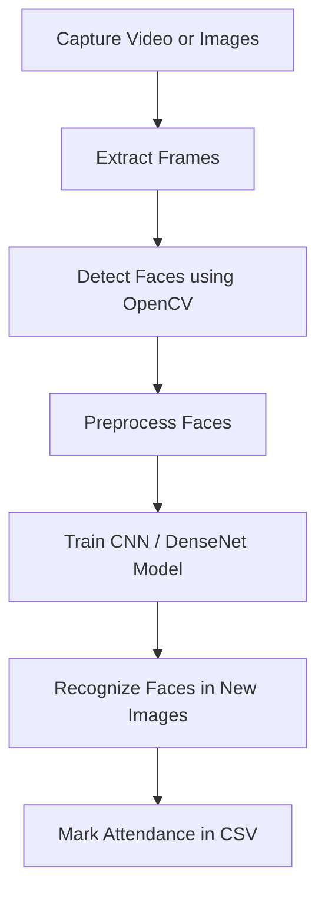

# 🎓 Student Attendance System (Face Recognition Based)

This project is a face-recognition-based **Student Attendance System** built using deep learning and computer vision techniques. It detects and recognizes student faces from video or images and automatically logs attendance.

> 👨‍💻 This repository contains **two separate versions** of the system — each in its own branch — using different deep learning approaches.

---

## 📌 Project Features

- 🎥 Face detection from images or video frames
- 🧠 Deep learning-based face recognition
- 🗂️ Automated attendance logging
- 🧪 Training pipeline for custom student datasets

---

## 🧠 System Versions

This repo includes **two different implementations** of the attendance system:

### 📁 1. `cnn-version` (Notebook 1)
> **Custom CNN-based face recognition system**

- Uses a **basic Convolutional Neural Network**.
- Simple model architecture.
- Trained from scratch on student face images.
- Good for learning, prototyping, or smaller datasets.

### 📁 2. `densenet-version` (Notebook 2)
> **Advanced DenseNet121-based system using transfer learning**

- Uses **DenseNet121**, a powerful pre-trained CNN.
- Higher accuracy and faster convergence.
- Ideal for larger, real-world datasets.
- Employs OpenCV for face detection and Keras for model training.

---

## 🌳 Branch Structure

| Branch             | Description                               |
|--------------------|-------------------------------------------|
| `main`             | Project overview + README only            |
| `cnn-version`      | Full project code for custom CNN approach |
| `densenet-version` | Full project code using DenseNet121       |

---

## 📸 System Flow (Both Versions)



---

## 📂 Folder Structure (per branch)

Each branch contains its own implementation:

```
.
├── notebooks
├── requirements.txt
└── README.md
```

---

## 🛠 Requirements

Each branch has its own `requirements.txt`, but common dependencies include:

- Python 3.8+
- TensorFlow / Keras
- OpenCV
- NumPy, Pandas

---

## 👏 Contributions

Contributions and improvements are welcome! If you'd like to improve the model, fix a bug, or enhance documentation, feel free to fork the repo and submit a pull request.

---

## 🧾 License

This project is licensed under the **Apache License 2.0**.  
See the [LICENSE](./LICENSE.md) file for full details.
